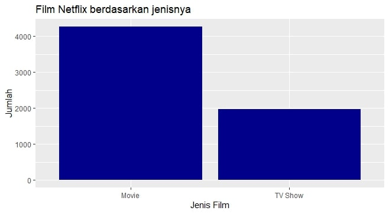
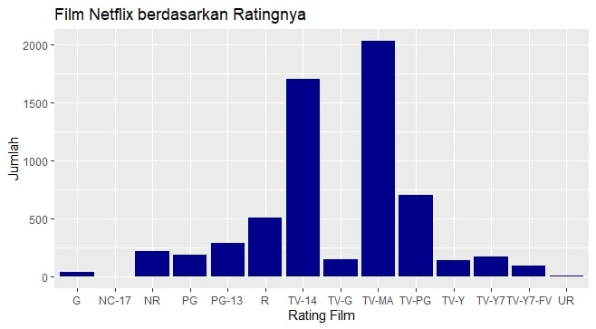
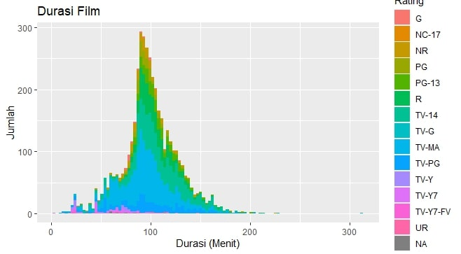

# Netflix-Movies-and-TV-Show-EDA

## Background
The “TV Shows and Movies listed on Netflix” dataset consists of television series and films that were on Netflix until 2009. The data from the dataset is obtained via Flixable, which is a third party search engine. The dataset also can be accessed from the [Kaggle](https://www.kaggle.com/shivamb/netflix-shows) website from a user named Shivam Bansal.
According to Bansal, the dataset from Netflix is interesting because the number of television series and films has tripled since 2010. The large number of datasets allows for a lot of insight that can be obtained through EDA.

## About the Datasets
The data dimensions used are 6234 rows and 12 columns. In detail, the columns of the dataset used consist of:
```
> str(df0)
'data.frame':	6234 obs. of  12 variables:
 $ show_id     : int  81145628 80117401 70234439 80058654...
 $ type        : chr  "Movie" "Movie" "TV Show" "TV Show" ...
 $ title       : chr  "Norm of the North: King Sized Adventure"...
 $ director    : chr  "Richard Finn, Tim Maltby" "" "" "" ...
 $ cast        : chr  "Alan Marriott, Andrew Toth, Brian Dobson, Cole Howard, Jennifer Cameron, Jonathan Holmes, Lee Tockar, Lisa Duru"...
 $ country     : chr  "United States, India, South Korea, China"...
 $ date_added  : chr  "September 9, 2019" "September 9, 2016"...
 $ release_year: int  2019 2016 2013 2016 2017 2016 2014 ...
 $ rating      : chr  "TV-PG" "TV-MA" "TV-Y7-FV" "TV-Y7" ...
 $ duration    : chr  "90 min" "94 min" "1 Season" "1 Season" ...
 $ listed_in   : chr  “Stand-Up Comedy" "Kids' TV" "Kids' TV" ...
 $ description : chr  "Before planning an awesome wedding for his grandfather, a polar bear king must take back a stolen artifact from"| __truncated__ "Jandino Asporaat riffs on the challenges of raising kids and serenades the audience with a rousing rendition of"| __truncated__ "With the help of thr
```
## Objective 
The basic exploratory data analysis will be done, including:
- Variation: Categorical Variable
- Variable: Continous Variable
- CovariationL Categorical vs Categorical Variable
- Covariation: Categorical vs COntinous Variable
The analysis analysis will be carried out using R progamming language.

# Data Cleaning and Pre-Processing
The data is not perfect, so it needs to be cleaned. They are:
- Incomplete dataset. There is blank space in the dataset.
- There are some data that must be converted from char to num such as date_added.
- Lack of continuous data so that data analysis is limited.<br>
<br>The libraries used are:
```
library(dplyr)
library(ggplot2)
library(tidyverse)
```
The dataset has blank data which is blankspace. To make the search easier, the blankspace will be changed to NA:
`df0[df0==""] <- NA`
In the duration data column consists of two, namely minutes (minutes) to indicate film and season to indicate TV Show. For easier reading, this column's data type must be changed from chr to int.
```
#Changing minute
df0b<-df0
df0b$duration=as.numeric(gsub(" min", "", df0$duration))
#Changing season
df0s<-df0
df0s$duration=as.numeric(gsub(" Season","",df0s$duration))
```
The same is done for the date_added column. In order to be used (as year information), this column is also modified using the following code:
```
#Changing year added
dfyear<-df0
dfyear1<-str_sub(dfyear$date_added, start= -4)
dfyear3<-as.numeric(dfyear1)
dfyear$date_added<-dfyear3
```

# Exploratory Data Analysis
## Categorical Variable #1
This analysis is intended to find out what types of Netflix products are the most.
```
ggplot(data=df0)+
  geom_bar(mapping=aes(x=type),fill="darkblue")+
  xlab("Jenis Film")+
  ylab("Jumlah")+
  ggtitle("Film Netflix berdasarkan jenisnya")
 ```
 The result of the code: <br><br>
 <br><br>
 It can be seen that the type of movie movie or single film outnumbered a TV show or television series. To calculate the number of movies and TV shows specifically, codes are used:
```
#calculating
dfjumlahmov=plyr::count(df0,'type')
```
From the run results, it can be seen that the number of movies is 4265 products, while the TV Show is 1969 products.
 
## Caregorical Variable #2
This analysis is intended to find out what types of ratings are the most on Netflix?
```
ggplot(data=subset(df0, !is.na(rating)),aes(x=rating))+
  geom_bar(stat="count",fill="darkblue")+
  xlab("Rating Film")+
  ylab("Jumlah")+
  ggtitle("Film Netflix berdasarkan Ratingnya")
 ```
 The result of the code:<br><br>
 <br><br>
Before further interpretation, it is better to know the meaning of film ratings. Movie ratings are recommendations / guidelines for viewers based on age groups. This system was developed by the Motion Picture Association. The following is the description:
- G	: General Audience (All Ages Admitted)
- NC-17	: Adults Only, No One 17 and Under Admitted.
- NR	: Not Rated. Film has not been submitted for a rating or is an uncut version
- PG	: Parental Guidance Suggested. Some material may not be suitable for children.
- PG-13	: PG-13 – Parents Strongly Cautioned. Some material may be inappropriate for children under 13.
- R	: Restricted. Under 17 requires accompanying parent or adult guardian.
- TV-14	: Unsuitable for children under the age of 14
- TV-G	: Generally suited for all audiences, though they may not necessarily contain content of interest to children
- TV-MA: This program is intended to be viewed by mature, adult audiences and may be unsuitable for children under 17.
- TV-PG: This program contains material that parents may find unsuitable for younger children. Parental guidance is recommended.
- TV-Y	: This program is aimed at a very young audience, including children from ages 2-6.
- TV-Y7	: This program is most appropriate for children age 7 and up.
- TV-Y7-YV: Programs given the "FV" content descriptor exhibit more 'fantasy violence and are generally more intense or combative than other programs rated TV-Y7.
- UR	: Unrated.


From the graph, it can be seen that the type of film with a TV-MA rating has the highest number, followed by TV-14 and TV-PG. While the smallest is NC-17. The amounts are as follows:
```
dfjumlahrat=plyr::count(df0,'rating')
```
As a result, there were 2027 films with TV-MA rating, 1698 TV-14 and 701 TV-PGs. Meanwhile, there were only 2 films with NC-17 rating.
## Continous Variable #1
This analysis is intended to find out how is the rate at which Movies are added on Netflix?
### Cleaning the Data
Creates a dataframe containing only the film type and the date the film was added. We use pipeline to make the process quicker:
```
df0movies<-dfyear %>%
  select(type, title, date_added) %>%
  filter(type == "Movie")
```
After that we creates a dataframe that contains the total calculated amount per film change date. In addition, the number of films in 2020 is not counted because 2020 is not yet finished. 
```
df0moviescount=df0movies%>%
  filter(type=="Movie")%>%
  count(type,date_added)%>%
  arrange(desc(n))
df0moviescount=df0moviescount[-c(5),]
```
The main code for visualizing the data that has been prepared is:
```
ggplot(data=subset(df0moviescount, !is.na(date_added)), aes(x=date_added, y=n, group=1)) +
  scale_x_continuous(breaks = seq(2008, 2019, by = 1))+
  geom_point()+
  geom_line()+
  ggtitle("Jumlah Film yang ditambahkan")+
  ylab('Jumlah')+xlab('Tahun')
```
The result:<br><br>
<br><br>
The number of films can be seen to have increased quite sharply after 2015. The number of films in Netflix experienced the most significant increase in the 2016-2017 period, seen from the sloping graphics. After 2017, the increase in films experienced a continuous decline, as seen from the decreasing slope of the graphic.

## Continous Variable #2
This analysis is intended to find out how is the rate at which Tv Series are added on Netflix?
### Cleaning the Data
Creates a dataframe containing only the film type and the date the TV Show was added:
```
df0tvshow<-dfyear %>%
  select(type, title, date_added) %>%
  filter(type == "TV Show")
```
After that we creates a dataframe that contains the total calculated amount per TV Show change date. In addition, the number of TV shows in 2020 is not counted because 2020 is not finished yet:
```
df0tvshowcount=df0tvshow%>%
  filter(type=="TV Show")%>%
  count(type,date_added)%>%
  arrange(desc(n))
df0tvshowcount=df0tvshowcount[-c(5,7),]
```
The main code for visualizing the data that has been prepared is:
```
ggplot(data=subset(df0tvshowcount, !is.na(date_added)), aes(x=date_added, y=n, group=1)) +
  scale_x_continuous(breaks = seq(2008, 2019, by = 1))+
  geom_point()+
  geom_line()+
  ggtitle("Jumlah TV Series yang ditambahkan")+
  ylab('Jumlah')+xlab('Tahun')
```
Result:<br><br>
<br><br>
It can be seen that the trend of TV Show which is added every year continues to increase. With the increase that occurred in 2018 - 2019. The increase occurred by 301 films and this increase was the highest due to the large slope rate (seen from the graphic)
## Continous Variable #3
This analysis is intended to find out how is the distribution of TV ratings based on the release year?
The code:
```
ggplot(df0)+
  geom_histogram(mapping=aes(x=release_year,fill=rating),binwidth=3)+
  xlab("Tahun Rilis")+ylab("Jumlah")+
  ggtitle("Tahun Rilis Film")+labs(fill="Rating")
```
Result:<br><br>
<br><br>
It can be seen from the graph that the majority of the film's release dates are new films (over the 2000s), with the spread of TV-MA and TV-14 being the majority of the ratings for the films released. Both types of ratings are mostly on Netflix.
## Continous Variable #4
This analysis is intended to find out how is the distribution of film duration on Netflix?
The code:
```
ggplot(data=subset(df0b,!is.na(duration)),aes(x=duration))+
  geom_histogram(mapping=aes(x=duration,fill=rating),binwidth=3)+
  xlab("Durasi (Menit)")+ylab("Jumlah")+
  ggtitle("Durasi Film")+labs(fill="Rating")
```
The result:<br><br>
<br><br>
It can be seen from the graph that the majority of films have a duration of 98-100 minutes. More precisely, using the code:
```
> summary(df0b$duration)
   Min. 1st Qu.  Median    Mean 3rd Qu.    Max.    
    3.0    86.0    98.0    99.1   115.0   312.0
```
There are some outliers in very long and very short films. The film with a maximum duration is entitled Black Mirror: Bandersnatch which was released in 2018 with a duration of 312 minutes. Meanwhile, the shortest film titled Silent, which was released in 2014, has a duration of 3 minutes.
## Categorical vs Categorical Variable #1
This analysis is intended to show what types of ratings are available on TV Shows?
### Data Cleaning
Before doing the plot, data is collected first by selecting films of the type of TV Show and calculating the number according to the rating. Here's the code:
```
df0s1<-df0
DurasiCount1=df0s1%>%
  filter(duration=="1 Season")%>%
  count(rating,duration)%>%
  arrange(desc(n))
```
Once calculated, it can be plotted. The code:
```
ggplot(data=subset(DurasiCount1,!is.na(rating)),mapping=aes(x=duration,y=rating))+
  geom_tile(mapping=aes(fill=n))+
ggtitle("Rating Film Series")+ labs(fill = "Freq")+
  ylab('Rating')+xlab('Film berjenis Series')
```
The result:<br><br>
<br><br>
It can be seen that the most series-type films (TV Show) are films with TV-Ma and TV-14 ratings, followed by TV-PG. This shows that films and TV shows have a similar distribution of film ratings.
## Categorial vs Categorical Variable #2
This analysis is intended to show which movies with ratings were added to Netflix by year?
### Data Cleaning
Before doing the plot, data is collected first by selecting films based on their rating and calculating the number according to the year (date_added). Here's the code
```
tile_date<-dfyear%>%
  count(rating,date_added)%>%
  arrange(desc(n))
```
The code to display the graph is:
```
ggplot(data=subset(tile_date,!is.na(rating)),mapping=aes(x=date_added,y=rating))+
  geom_tile(mapping=aes(fill=n))+
  ggtitle("Date Added by Rating")+ labs(fill = "Freq")+
  ylab('Rating')+xlab('Tahun ditambahkan')
```
Result:<br><br>
<br><br>
It can be seen from the color change that films with a TV-MA and TV-14 rating contributed to the highest number of films added to Netflix in 2017-2019.
## Categorical vs Continous Variable
This analysis is intended to show how is the distribution of film duration based on the film rating?
The code:
```
ggplot(data=subset(df0b,!is.na(rating),!is.na(duration))) + 
  geom_boxplot(mapping = aes(x=rating, y=duration))+ 
  scale_y_continuous(breaks = seq(0,800,100))+ 
  ggtitle('Distribusi Durasi tiap Rating')+ 
  xlab('Rating')+ theme_minimal()
```
Result:<br><br>
<br><br>
Before interpreting the graph, it is important to know how to read the boxplot.<br><br>
<br><br>
The quantities of Q1, Q3, median, and IQR can be seen using:
```
df0G<-df0b %>%
  select(rating, duration) %>%
  filter(rating == "TV-MA")
df0G=subset(df0G,!is.na(duration))
summary(df0G$duration)
IQR(df0G$duration)
```
For example, the NC-17 rating data, the results are:
```
> summary(df0G$duration)
   Min. 1st Qu.  Median    Mean 3rd Qu.    Max. 
   83.0   107.2   131.5   131.5   155.8   180.0 
> IQR(df0G$duration)
[1] 48.5
```
It can be seen that IQR is the length of the box, while Q1 and Q3 are the upper and lower limits of the box. IQR is an result between Q3 minus Q1. That means, most of the film duration of the NC-17 rating is between 107.2 minutes and 155.8 minutes. Meanwhile, the data from NC-17 does not show any outliers because there is no duration that exceeds the minimum and maximum boxplot. An example of data that has outliers is TV-MA
```
> summary(df0G$duration)
   Min. 1st Qu.  Median    Mean 3rd Qu.    Max. 
   12.0    82.0    95.0    95.3   108.0   312.0 
> IQR(df0G$duration)
[1] 26
```
It can be seen that the minimum data (Q1 - 1.5IQR) is 43, then the data duration that is under 43 minutes is referred to as outlier data.
